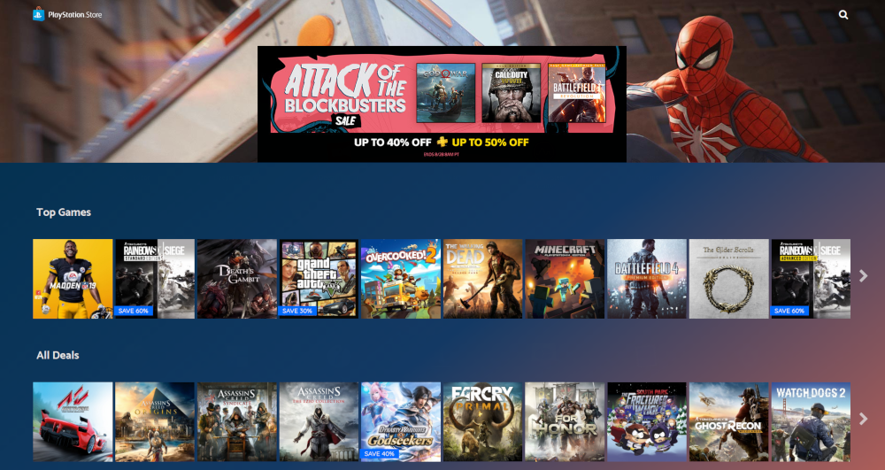
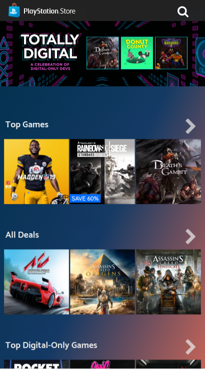
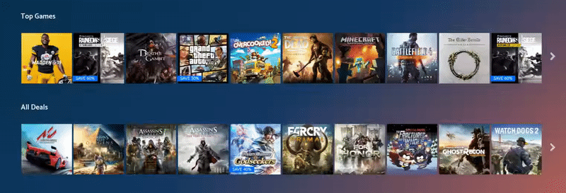

# psn-price-tracker

Interactive and responsive price tracker website for Playstation Store, highly inspired by Netflix's UI, designed and coded by [Seungwan Noh](https://github.com/swnoh).

This project was developed with React, Html5, CSS3, Flask, Scrapy, and Postgresql and deployed on Azure.

Demo: [http://psntracker.azurewebsites.net](http://psntracker.azurewebsites.net)



## Development Stack

- Deployed on Azure.
- Backend stack: Flask, SQLAlchemy ORM, Scrapy.
- Frontend stack: React, Webpack, Babel.
- Backend API: RESTful API.
- Database utilizes a Postgresql with Azure.
- Libraries for React: React Bootstrap, React Router4, TransitionGroup, React Lazy Load, Slick.js, Chart.js

## Features

- Tracking the price history
- Checking Lowest price ever
- Instant search
- Responsive design
- Mobile friendly

## User Interface

### Mobile View



### Carousel Sliders



### Detail Panel


### Instant Search


## Build

To build and run this application locally, you'll need a dedicated database. Here are some commands that I used for building and deploying apps.

### Client(React) Build

```
cd static
npm run build
```

### Server

```
cd server
source venv/bin/activate

pip install -r requirements.txt
FLASK_APP=app.py DBHOST="<SERVER_HOST_NAME>" DBUSER=<USERNAME> DBNAME=<DATABASE_NAME> DBPASS=<PASSWORD> flask run
```

### Docker

#### Run locally

```
docker build -t psn-tracker .
docker run -it --env DBPASS="<PASSWORD>" --env DBHOST="<SERVER_HOST_NAME>" --env DBUSER="<USERNAME>" --env DBNAME="<DATABASE_NAME>" -p 5000:5000 psn-tracker
```

#### Upload app to a container registry

```
docker build -t psn-tracker
docker tag psn-tracker <REGISTRY_NAME>
docker push <REGISTRY_NAME>
```
